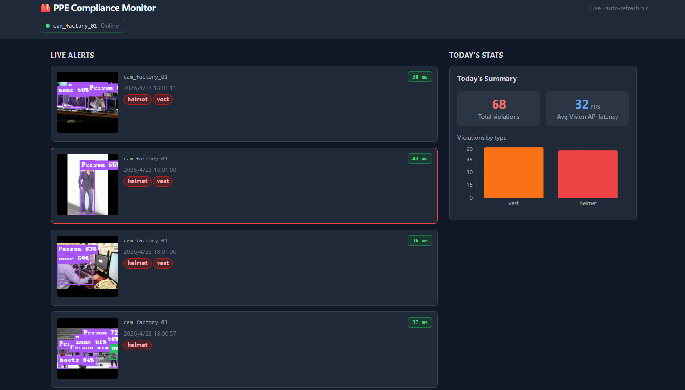
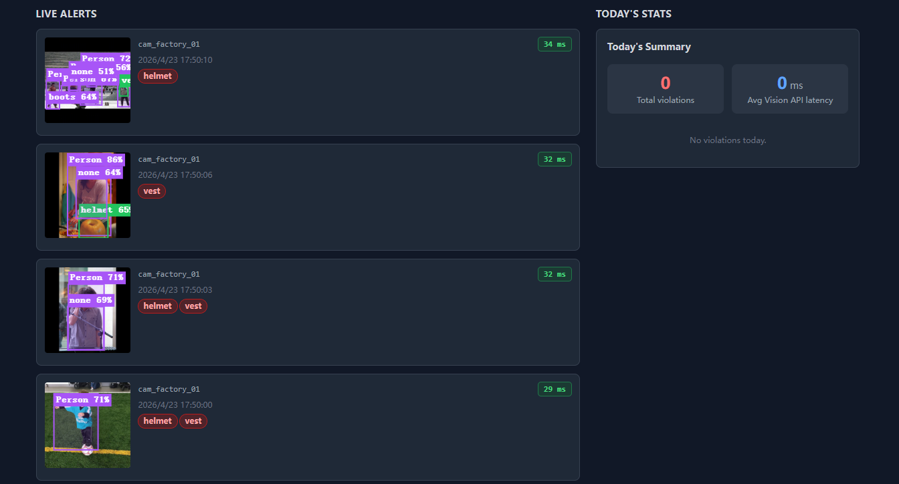

# PPE Compliance Monitor — 工厂 PPE 合规性实时监控系统

[](https://www.python.org/)
[](https://fastapi.tiangolo.com/)
[](https://react.dev/)
[](https://docs.docker.com/compose/)
[](LICENSE)

一套面向工厂环境的**生产级 PPE（个人防护装备）合规性自动化监控系统**。系统通过 RTSP 视频流实时采集摄像头画面，调用 Yandex Vision API 进行 AI 检测，在发现未佩戴安全头盔或安全背心等违规行为时自动告警、存档，并通过 React 实时仪表板向管理人员展示。

---

## 效果展示

### 主仪表板 — 实时告警 & 今日统计



> 左侧实时告警列表每 5 秒自动刷新，显示摄像头编号、违规时间、违规类型及缩略图；右侧展示当日违规总数、平均 Vision API 延迟及按类型分类的柱状图。

### 违规详情弹窗 — 边界框可视化



> 点击任意告警条目可查看完整快照，图像上叠加 AI 检测到的边界框（紫色=人体、绿色=头盔、青色=背心），并标注置信度分数。底部显示摄像头编号、违规时间、违规类型及快照上传状态。

---

## 功能特性

- **实时视频流采集**：通过 OpenCV 连接多路 RTSP 摄像头，每 2 秒截取一帧，断线自动重连（最多 5 次）
- **AI PPE 检测**：调用 Yandex Vision API 识别安全头盔、安全背心等装备，缺失即触发违规
- **边界框可视化**：存储并展示 AI 返回的检测框坐标，前端直接在快照上重绘
- **违规快照存档**：自动上传至 Yandex Object Storage（S3 兼容），路径规则 `violations/{camera_id}/{date}/{timestamp}.jpg`
- **结构化数据库记录**：PostgreSQL 存储完整事件元数据，含置信度、延迟、原始 API 响应
- **REST API**：FastAPI 提供违规查询、摄像头状态、统计汇总接口，自动生成 OpenAPI 文档
- **React 实时仪表板**：5 秒轮询刷新，支持按摄像头/时间范围筛选历史记录
- **手动检测上传**：支持上传单张图片进行即时 PPE 检测，结果不写入数据库
- **容器化部署**：提供 Dockerfile + docker-compose，一键启动后端与数据库

---

## 系统架构

```
RTSP 摄像头
    │
    ▼
Video_Processor (OpenCV + asyncio)
    │  每 2 秒截帧
    ▼
Vision_Analyzer (Yandex Vision API)
    │  返回 AnalysisResult（含边界框、延迟、原始响应）
    ▼
Violation_Recorder (boto3 → Yandex Object Storage)
    │  上传快照，返回 URL
    ▼
Event_Repository (asyncpg → PostgreSQL)
    │  写入违规事件记录
    ▼
API_Server (FastAPI :8000)
    │  REST JSON
    ▼
Dashboard (React + Tailwind :3000)
```

---

## 目录结构

```
ppe-vision-monitor/
├── backend/
│   ├── main.py                    # FastAPI 应用入口 & 生命周期管理
│   ├── config.py                  # 环境变量加载（pydantic-settings）
│   ├── modules/
│   │   ├── video_processor.py     # RTSP 帧提取 & 多路摄像头管理
│   │   ├── vision_analyzer.py     # Yandex Vision API 调用 & 结果解析
│   │   ├── violation_recorder.py  # S3 快照上传 & 重试逻辑
│   │   └── event_repository.py    # PostgreSQL CRUD & 查询过滤
│   ├── api/
│   │   ├── routes/                # violations / cameras / stats 路由
│   │   └── schemas.py             # Pydantic 请求/响应模型
│   ├── db/
│   │   └── migrations/            # SQL 初始化脚本
│   ├── tests/                     # 属性测试（hypothesis）
│   ├── requirements.txt
│   └── Dockerfile
├── frontend/
│   ├── src/
│   │   ├── components/            # React 组件
│   │   ├── api/                   # API 客户端 & 类型定义
│   │   └── App.tsx
│   └── package.json
├── docs/
│   └── images/                    # 效果截图
├── docker-compose.yml
└── .env.example
```

---

## 快速开始

### 前置要求

- Docker & Docker Compose
- Node.js 18+（前端开发）
- Yandex Cloud 账号（Vision API + Object Storage）

### 1. 克隆仓库

```bash
git clone https://github.com/fj223/ppe-vision-monitor.git
cd ppe-vision-monitor
```

### 2. 配置环境变量

```bash
cp .env.example .env
```

编辑 `.env`，填入以下必需配置：

| 变量 | 说明 |
|------|------|
| `DATABASE_URL` | PostgreSQL 连接字符串 |
| `YOS_ENDPOINT_URL` | Yandex Object Storage 端点 |
| `YOS_ACCESS_KEY_ID` | S3 访问密钥 ID |
| `YOS_SECRET_ACCESS_KEY` | S3 访问密钥 Secret |
| `YOS_BUCKET_NAME` | 存储桶名称 |
| `YANDEX_VISION_API_KEY` | Yandex Vision API 密钥 |
| `YANDEX_VISION_FOLDER_ID` | Yandex Cloud 文件夹 ID |
| `RTSP_STREAMS` | 摄像头流地址，格式：`cam_01=rtsp://...` |

### 3. 启动后端（Docker Compose）

```bash
docker-compose up --build
```

后端 API 运行于 `http://localhost:8000`，OpenAPI 文档：`http://localhost:8000/docs`

### 4. 启动前端

```bash
cd frontend
npm install
npm run dev
```

前端运行于 `http://localhost:3000`

---

## API 接口

| 方法 | 路径 | 说明 |
|------|------|------|
| `GET` | `/api/v1/violations` | 查询违规事件列表（支持过滤） |
| `GET` | `/api/v1/violations/{event_id}` | 获取单条违规事件详情（含边界框） |
| `GET` | `/api/v1/cameras` | 获取所有摄像头状态 |
| `GET` | `/api/v1/stats` | 获取违规统计汇总 |
| `POST` | `/api/analyze-upload` | 上传图片进行即时检测 |
| `GET` | `/health` | 健康检查 |

查询参数（`/api/v1/violations`）：`camera_id`、`start_time`、`end_time`、`violation_type`、`limit`、`offset`

---

## 数据库 Schema

```sql
CREATE TABLE violation_events (
    event_id            UUID PRIMARY KEY DEFAULT gen_random_uuid(),
    camera_id           VARCHAR(64)  NOT NULL,
    timestamp           TIMESTAMPTZ  NOT NULL,
    violation_types     TEXT[]       NOT NULL,
    snapshot_url        TEXT,
    confidence_scores   JSONB        NOT NULL DEFAULT '{}',
    bounding_boxes      JSONB        NOT NULL DEFAULT '[]',  -- 边界框坐标
    processing_latency  INTEGER      NOT NULL,               -- Vision API 延迟（ms）
    raw_api_response    JSONB        NOT NULL DEFAULT '{}',  -- 完整原始响应
    upload_status       VARCHAR(16)  NOT NULL DEFAULT 'success',
    created_at          TIMESTAMPTZ  NOT NULL DEFAULT NOW()
);
```

---

## 测试

项目使用 `hypothesis` 进行属性测试，覆盖 7 个核心正确性属性：

```bash
cd backend
pytest tests/ -v
```

主要测试属性：
1. **违规判断完备性**：缺少任意必需 PPE 必标记为违规
2. **API 失败不误报**：Vision API 错误不产生违规记录
3. **存储路径格式正确性**：S3 路径严格符合规范
4. **违规事件记录完整性**：写入与读取数据完全一致（round-trip）
5. **查询过滤结果一致性**：返回结果满足所有过滤条件
6. **API 参数验证覆盖性**：非法参数返回 HTTP 422
7. **上传重试次数上限**：最多重试 3 次，失败标记 `pending_retry`

---

## 技术栈

| 层次 | 技术 |
|------|------|
| 后端框架 | FastAPI 0.111 + uvicorn |
| 数据库 | PostgreSQL 16 + asyncpg |
| AI 检测 | Yandex Vision API + YOLOv8 (ultralytics) |
| 对象存储 | Yandex Object Storage (boto3 S3) |
| 视频处理 | OpenCV (opencv-python-headless) |
| 前端 | React 18 + TypeScript + Tailwind CSS + Vite |
| 容器化 | Docker + Docker Compose |
| 测试 | pytest + hypothesis |
| 配置管理 | pydantic-settings |
| 日志 | structlog |

---

## 许可证

MIT License
